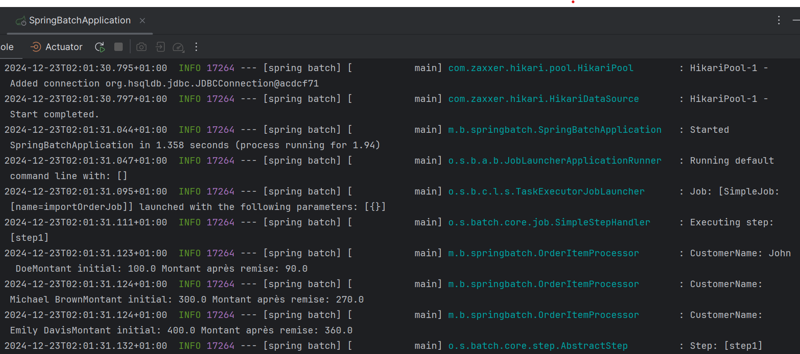
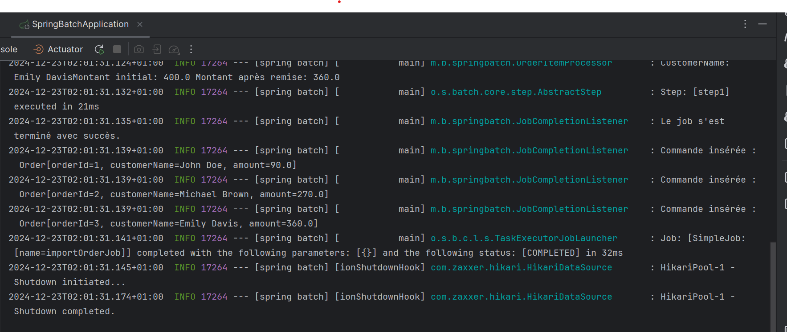

# Spring Batch Project: Traitement des Commandes

## Description

Ce projet a pour objectif de créer un job **Spring Batch** qui traite une liste de commandes provenant d'un fichier **CSV**. Chaque commande contient un identifiant, un nom de client et un montant. Le job applique une remise sur le montant des commandes et enregistre les données mises à jour dans une base de données.

### Fonctionnalités principales :
- Lecture des données à partir d'un fichier CSV.
- Application d'une remise sur le montant de chaque commande.
- Sauvegarde des commandes mises à jour dans une base de données relationnelle.
- Gestion du traitement à l'aide de Spring Batch (steps et jobs).


## Installation

1. Clonez ce repository sur votre machine locale :
```bash
   [git clone https://github.com/votre-utilisateur/votre-repository.git](https://github.com/dohabanoui/batch-processing-SpringBatch.git)](https://github.com/dohabanoui/batch-processing-SpringBatch.git)

```

## Structure du projet

- **BatchConfiguration.java** : Configure les étapes et le job Spring Batch.
- **OrderItemProcessor.java** : Contient la logique pour appliquer une remise sur les montants des commandes.
- **JobCompletionListener.java** : Écoute les événements de fin de job pour afficher les résultats.
- **Order.java** : Représente une commande (record immuable).
- **orders.csv** : Fichier d'entrée contenant les commandes à traiter.

Exemple de fichier CSV (`orders.csv`):

```csv
orderId,customerName,amount
1,John Doe,100.0
2,Jane Smith,200.0
3,Michael Brown,300.0
4,Emily Davis,400.0
```

**Execution du job**
Lorsque vous lancez le job, il lira le fichier CSV, appliquera une remise sur le montant des commandes, puis enregistrera les commandes mises à jour dans la base de données.

Voici un aperçu de l'exécution du job avec les logs de traitement des commandes :




